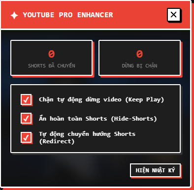

# YouTube Pro Enhancer - Chặn Tự Động Dừng & Ẩn YouTube Shorts

**YouTube Pro Enhancer** là một tiện ích mở rộng trình duyệt (Manifest V3) giúp bạn tối ưu hóa hoàn toàn trải nghiệm xem phim, nghe nhạc và giải trí trên YouTube. Tiện ích tập trung giải quyết 3 sự khó chịu lớn nhất: video tự động dừng khi treo máy, sự phân tâm từ YouTube Shorts và giao diện xem Shorts di động thiếu thốn tính năng trên máy tính.

---

## 📸 Giao diện Tiện ích
*(Bạn có thể chèn ảnh chụp màn hình giao diện của tiện ích vào đây dưới tên `screenshot.png`)*

---

## ✨ Các Tính năng Nổi bật

1. **Chặn tự động dừng video (Keep Play - Bypass Autopause)**:
   * Tự động phát hiện và nhấp "Có/Yes" trên hộp thoại *"Bạn còn đang xem không?"* (Are you still watching?) khi bạn treo tab nghe nhạc, podcast hoặc các video dài.
   * Đảm bảo video tiếp tục phát liên tục mà không bị gián đoạn.
2. **Ẩn hoàn toàn YouTube Shorts (Hide-Shorts)**:
   * Loại bỏ và ẩn sạch sẽ toàn bộ các kệ hàng Shorts, thẻ tab Shorts ở thanh bên, Shorts trên trang chủ và đề xuất liên quan.
   * Giúp bạn tập trung 100% vào việc học tập, làm việc mà không bị cuốn vào các video ngắn gây mất thời gian.
3. **Tự động chuyển hướng Shorts sang Video thông thường (Redirect Shorts)**:
   * Khi bạn vô tình click vào một link video Shorts, tiện ích sẽ tự động nhận diện ID và chuyển hướng bạn sang trang phát video máy tính chuẩn (`/watch?v=...`).
   * Giúp bạn xem video ngắn với đầy đủ tính năng của trình phát thường: thanh tua thời gian chi tiết, tăng/giảm âm lượng bằng chuột, phím tắt điều khiển và xem phần bình luận rõ ràng.
4. **Bảng điều khiển Glassmorphism Hiện đại**:
   * Thiết kế phẳng Neo-Brutalis cá tính với viền trắng, bóng đỏ nổi bật trên tông nền tối.
   * Panel sử dụng công nghệ mờ kính trong suốt (`backdrop-filter`) sang trọng, giúp bạn bật tắt các chế độ dễ dàng mà không cản tầm nhìn.
5. **Hiện/Ẩn nhật ký thông minh (Toggle Log)**:
   * Nhật ký được ẩn gọn gàng theo mặc định. Bạn có thể mở rộng phần "Hiện nhật ký" để theo dõi số lượng lần chặn tự động dừng hoặc số liên kết Shorts đã được chuyển hướng thành công.

---

## 🛠️ Hướng dẫn Cài đặt (Chrome, Edge, Brave, Cốc Cốc)

1. Tải hoặc sao chép thư mục `extensions_AutoPause_bypass` về máy tính của bạn.
2. Mở trình duyệt và truy cập trang quản lý Tiện ích mở rộng:
   * Trên **Microsoft Edge**: Truy cập `edge://extensions/`
   * Trên **Google Chrome**: Truy cập `chrome://extensions/`
3. Bật **Chế độ dành cho nhà phát triển** (Developer mode) ở góc trên bên phải màn hình.
4. Nhấp vào nút **Tải tiện ích đã giải nén** (Load unpacked) ở góc trên bên trái.
5. Chọn thư mục `extensions_AutoPause_bypass` (thư mục chứa file `manifest.json` này).
6. Biểu tượng **Nút Play màu Đỏ viền Trắng** siêu sắc nét của YouTube Pro Enhancer sẽ hiển thị trên thanh công cụ!

---

## 🚀 Hướng dẫn Sử dụng

1. Truy cập vào trang web [YouTube](https://www.youtube.com/).
2. Nhấp vào biểu tượng **YouTube Pro Enhancer** trên thanh công cụ trình duyệt để **Ẩn/Hiện** bảng điều khiển nổi.
3. Tích chọn hoặc bỏ chọn các tính năng mong muốn trên giao diện:
   * **Chặn tự động dừng video (Keep Play)**
   * **Ẩn hoàn toàn Shorts (Hide-Shorts)**
   * **Tự động chuyển hướng Shorts (Redirect)**
4. Các thiết lập sẽ được áp dụng ngay lập tức mà không cần tải lại trang. Tiện ích cũng tự động lưu lại trạng thái bật/tắt cho các lần truy cập sau!
